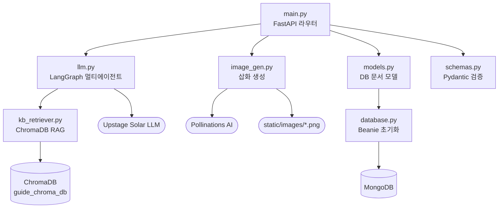
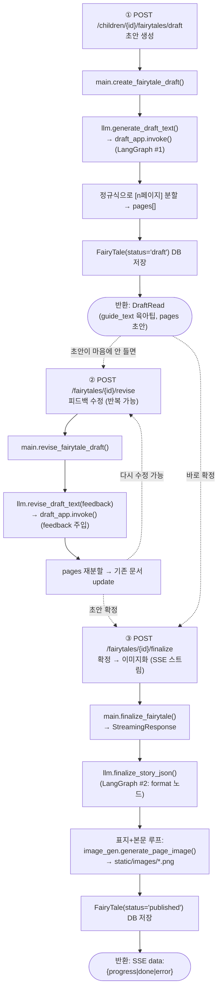
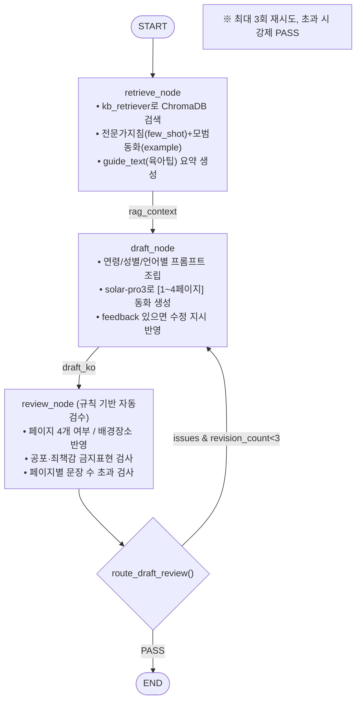
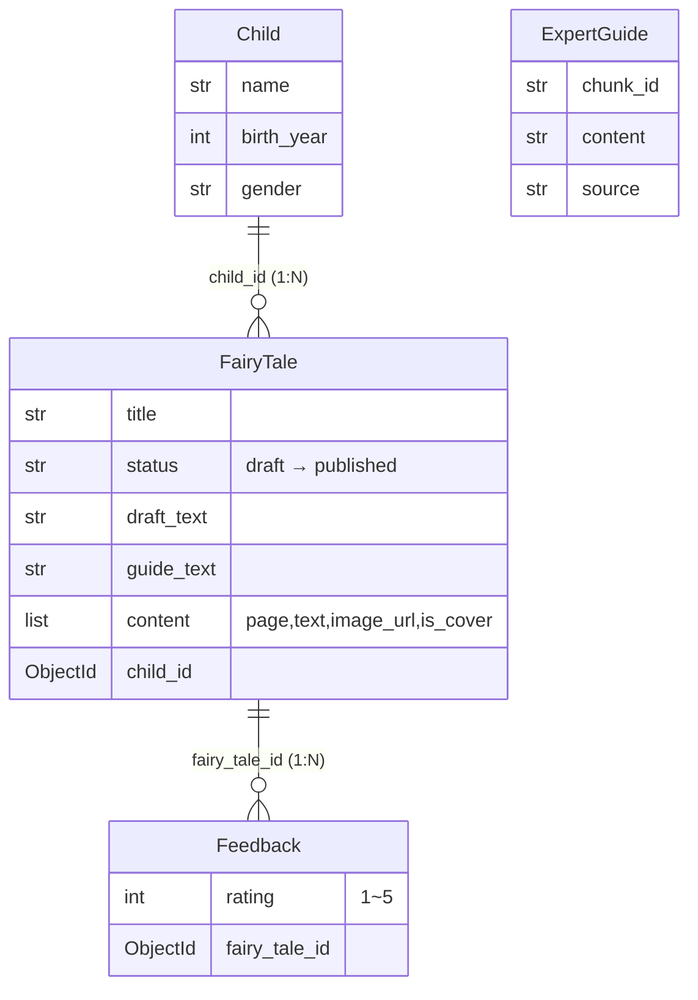
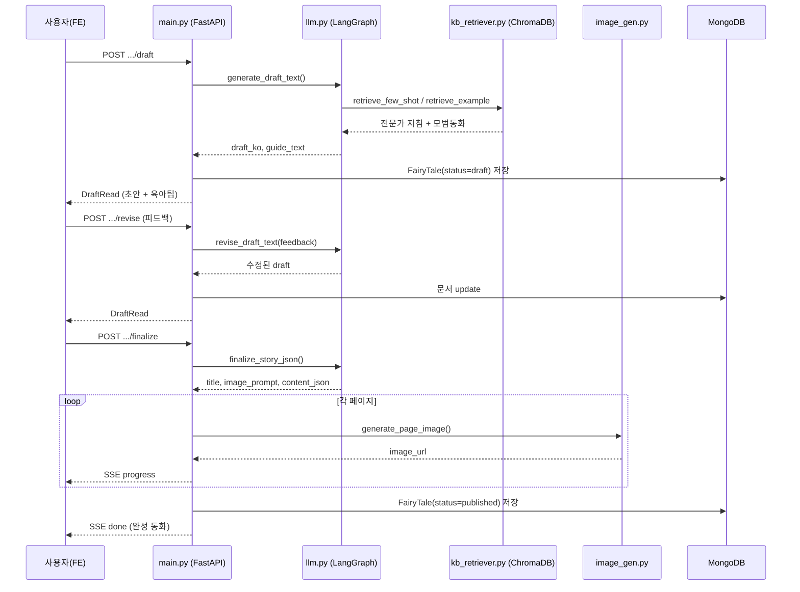

# 프로젝트 플로우 차트

FastAPI + LangGraph 멀티에이전트 RAG + MongoDB 기반의 **아동 행동교정 맞춤 동화 생성** 백엔드입니다.

---

## 1. 파일별 역할 & 의존 관계

| 파일 | 역할 |
| --- | --- |
| `main.py` | API 진입점 (FastAPI 라우터) |
| `database.py` | MongoDB(Beanie) 초기화 |
| `models.py` | DB 문서 모델 (Child / FairyTale / Feedback / ExpertGuide) |
| `schemas.py` | 요청·응답 검증 (Pydantic) |
| `llm.py` | 동화 텍스트 생성 (LangGraph 멀티에이전트) |
| `kb_retriever.py` | ChromaDB RAG 검색 (전문가 지침 + 모범동화 예시) |
| `image_gen.py` | 페이지별 삽화 생성 (Pollinations AI) |

### 의존 방향 (호출 관계)

---

## 2. V2 메인 플로우 (Human-in-the-Loop, 실제 사용 파이프라인)

3단계로 분리되어 **사용자가 초안을 검토·수정 후 확정**하는 구조입니다.

---

## 3. LangGraph 내부 노드 플로우 (llm.py 핵심)

### Graph #1 — Draft & Revise (`draft_app`)

### Graph #2 — Finalize (`finalize_app`)

> **참고:** `llm.py`에는 V1 레거시 원샷 API(`fairy_tale_app_legacy` = retrieve → draft → review → format → END)도 남아있으며,
> `main.py`의 `POST /children/{id}/fairytales`가 이를 사용합니다. 이미지까지 한 번에 동기 생성하는 방식입니다.

---

## 4. 데이터 모델 관계 (MongoDB)

> `ExpertGuide`는 전문가 지침 미러링용 모델이며, 현재 주 검색은 ChromaDB(`kb_retriever.py`)를 통해 이루어집니다.

---

## 5. 전체 요약 시퀀스

