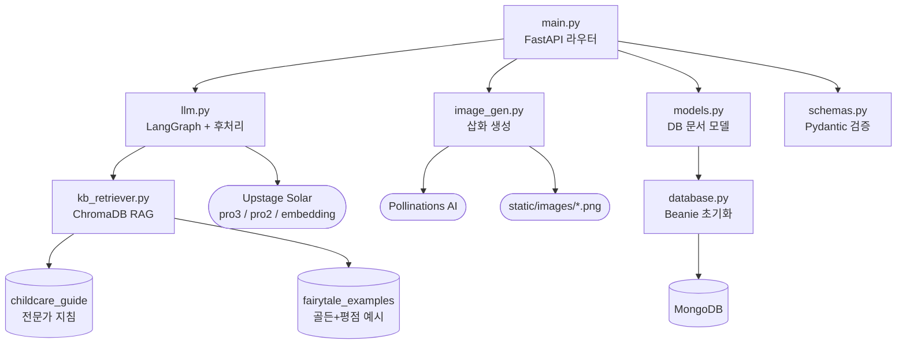
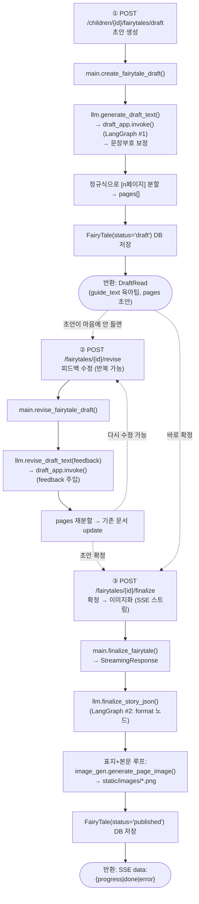
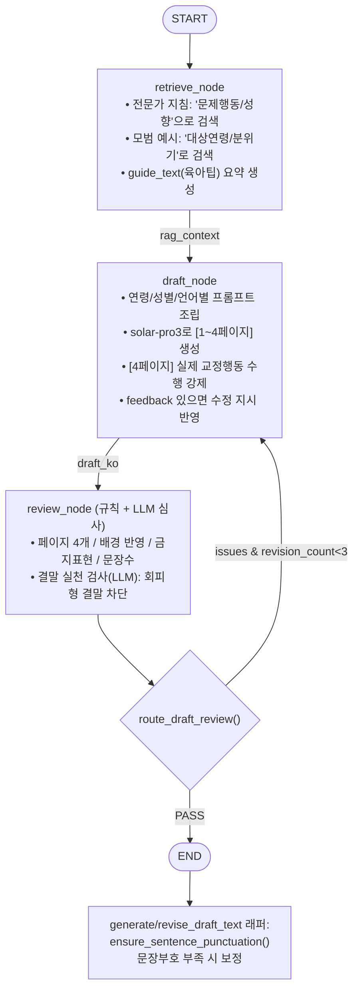
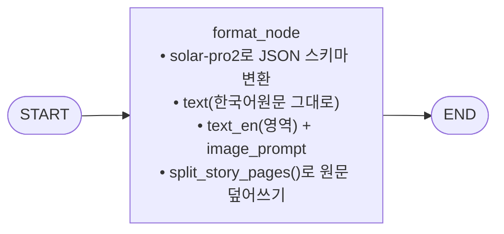
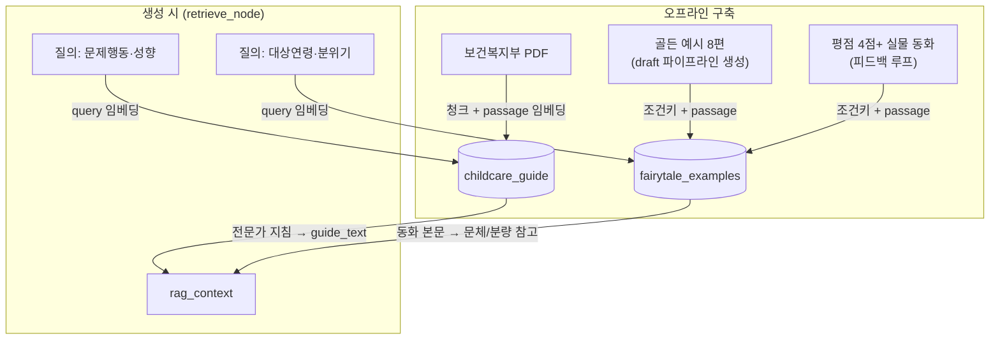
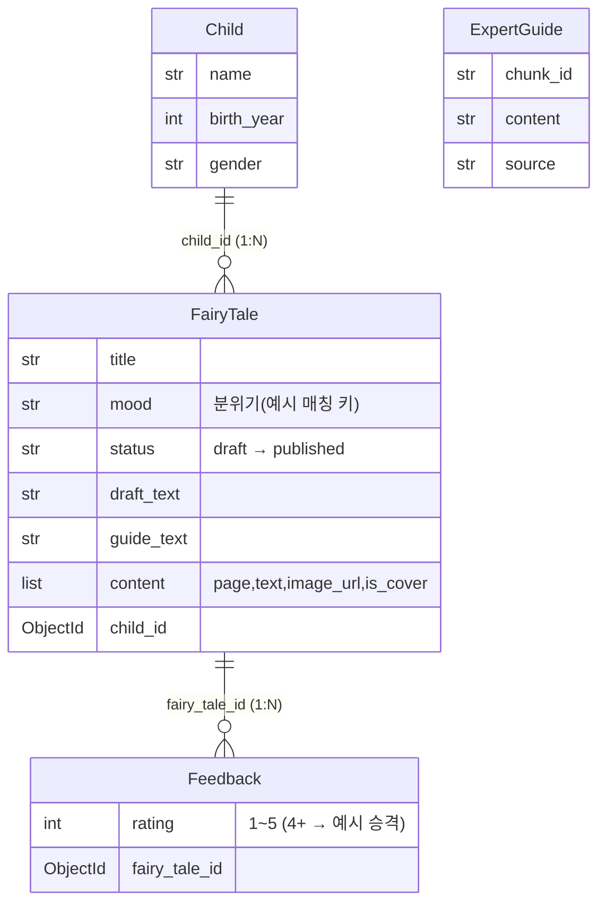
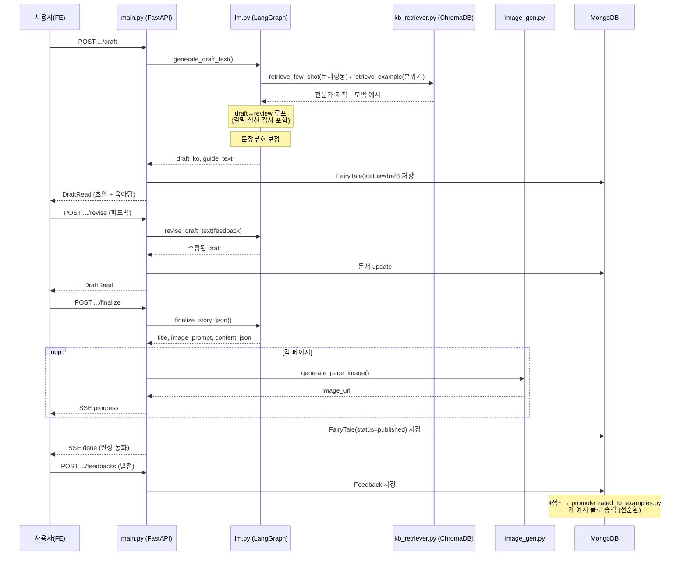

# 프로젝트 플로우 차트

FastAPI + LangGraph 멀티에이전트 RAG + MongoDB 기반의 **아동 행동교정 맞춤 동화 생성** 백엔드입니다.

---

## 1. 파일별 역할 & 의존 관계

| 파일 | 역할 |
| --- | --- |
| `main.py` | API 진입점 (FastAPI 라우터) |
| `database.py` | MongoDB(Beanie) 초기화 |
| `models.py` | DB 문서 모델 (Child / FairyTale / Feedback / ExpertGuide) |
| `schemas.py` | 요청·응답 검증 (Pydantic) |
| `llm.py` | 동화 텍스트 생성 (LangGraph 멀티에이전트) + 문장부호 보정 + 결말 검사 |
| `kb_retriever.py` | ChromaDB RAG 검색 (지침=문제행동 / 예시=분위기, passage·query 분리) |
| `image_gen.py` | 페이지별 삽화 생성 (Pollinations AI) |

### 오프라인 데이터 파이프라인 스크립트 (`scripts/`)

| 스크립트 | 역할 |
| --- | --- |
| `build_guide_chroma.py` | 전문가 PDF → passage 임베딩 → `childcare_guide` 구축 |
| `reembed_passage.py` | 기존 청크를 passage 모델로 재색인 |
| `eval_rag.py` | RAG 검색 A/B 평가 (query vs passage) |
| `label_examples.py` / `build_example_index.py` | 예시 라벨 생성 → 조건키 색인 |
| `build_golden_examples.py` | 영유아 4페이지 '골든 예시' 생성·교체 |
| `promote_rated_to_examples.py` | 평점 4점+ 실물 동화 → 예시 풀 승격 (피드백 루프) |

### 의존 방향 (호출 관계)

---

## 2. V2 메인 플로우 (Human-in-the-Loop, 실제 사용 파이프라인)

3단계로 분리되어 **사용자가 초안을 검토·수정 후 확정**하는 구조입니다.

> 발행(published)되고 사용자가 **별점 4점 이상**을 주면, `promote_rated_to_examples.py`가 그 동화를
> 예시 풀(`fairytale_examples`)로 승격시켜 이후 생성 품질을 높이는 **선순환 루프**를 형성합니다. (4장 참고)

---

## 3. LangGraph 내부 노드 플로우 (llm.py 핵심)

### Graph #1 — Draft & Revise (`draft_app`)

> **결말 실천 검사**: `check_resolution_performed()`가 solar-pro2로 "주인공이 [문제 상황]의 목표 행동을
> 4페이지에서 실제로 수행했는지" 판정. 치우기·미루기·회피로 끝나면 재작성 유도. (편식→먹기, 양치거부→닦기 등 문제유형 무관)

### Graph #2 — Finalize (`finalize_app`)

> **참고:** `llm.py`에는 V1 레거시 원샷 API(`fairy_tale_app_legacy` = retrieve → draft → review → format → END)도 남아있으며,
> `main.py`의 `POST /children/{id}/fairytales`가 이를 사용합니다.

---

## 4. RAG / 예시 데이터 파이프라인

전문가 지침과 모범 예시를 서로 **다른 기준**으로 검색합니다. 문서는 `passage` 모델, 질의는 `query` 모델로
임베딩하는 **비대칭 검색**으로 정확도를 높였습니다. (`eval_rag.py`: Hit@1 0.81 → 0.87)

### 피드백 선순환 루프

---

## 5. 데이터 모델 관계 (MongoDB)

> `Feedback.rating`이 4 이상이면 해당 `FairyTale`이 예시 풀로 승격됩니다(4장 피드백 루프).

---

## 6. 전체 요약 시퀀스

