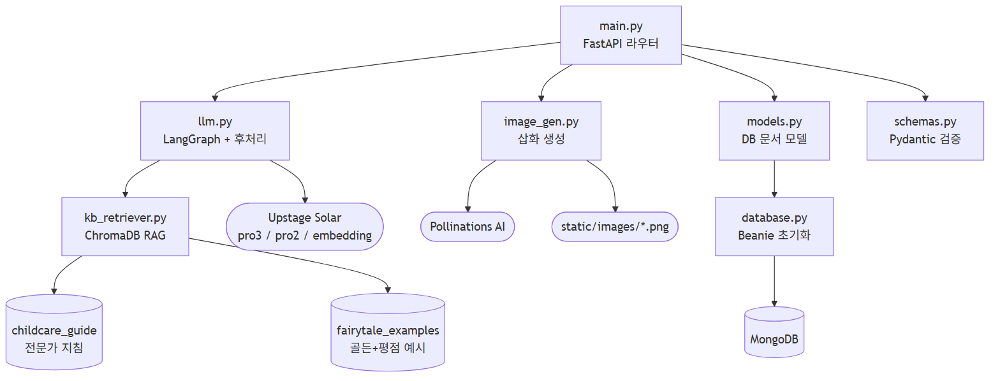
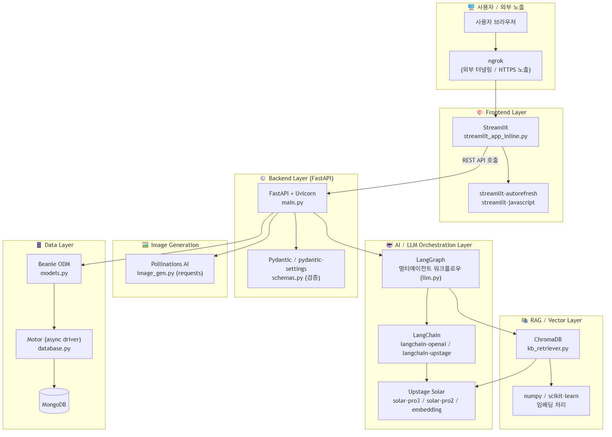

# 📖 SMILE — 행동 교정 맞춤 동화 생성 서비스

> 아이의 **문제 상황**과 **성격**을 입력하면, 올바른 행동을 자연스럽게 유도하는 **맞춤형 그림동화**를 AI가 만들어 줍니다.

기계적인 지시나 정서적 협박("네가 그래서 엄마가 슬펐어") 대신, 아이의 감정을 100% 수용하고 **놀이식 시뮬레이션**을 통해 긍정적인 방향으로 행동을 교정하도록 설계했습니다. 보건복지부 아동 심리 전문가 지침을 **RAG**로 검색해 이야기에 녹여내며, 사용자가 초안을 검토·수정한 뒤 확정하는 **Human-in-the-Loop** 파이프라인을 갖췄습니다.

<p>
  
  
  
  
  
  
  
</p>

---

## 주요 기능

- **맞춤형 동화 생성** — 아이의 이름·나이·성별·성격·문제 상황·배경을 반영한 기승전결 4페이지 동화
- **RAG 기반 전문가 지침 적용** — ChromaDB에서 아동 심리 지침을 검색(문서=passage / 질의=query 비대칭 임베딩)해 이야기에 자연스럽게 반영
- **분위기 기반 예시 매칭** — 대상 연령·분위기로 모범 동화 예시를 검색해 문체/분량 참고 (플롯 차용은 금지)
- **멀티에이전트 자동 검수** — `retrieve → draft → review` 루프로 금지 표현(공포·죄책감)·분량·배경 반영에 더해, **결말에서 목표 행동을 실제로 수행했는지(회피형 결말 차단)를 LLM으로 검사** (최대 3회 재시도)
- **문장부호 자동 보정** — 모델이 문장부호를 누락하는 경우를 감지해 보정
- **피드백 선순환** — 사용자 별점 **4점 이상** 동화를 예시 풀로 승격해 이후 생성 품질을 높임
- **Human-in-the-Loop** — 초안 확인 → 피드백 수정 → 확정의 3단계 파이프라인
- **삽화 자동 생성** — 페이지별 이미지 프롬프트를 추출해 일관된 화풍의 그림 생성
- **연령별 어휘/문체 튜닝** — 만 3세 이하/4세/그 이상에 따라 어휘·의성어 규칙 차등 적용
- **한국어/영어 지원**

---

## 🏗 시스템 아키텍처

### 파일별 의존 관계



### 기술 스택 계층 구조



> 전체 플로우 차트는 [`FLOWCHART.md`](FLOWCHART.md), 기술 스택 상세는 [`TECH_STACK.md`](TECH_STACK.md),
> RAG 검색 성능 개선 과정은 [`WALKTHROUGH.md`](WALKTHROUGH.md)를 참고하세요.
> (렌더링된 다이어그램 이미지는 [`diagrams/`](diagrams/) 폴더에 PNG/SVG로 제공됩니다.)

---

## 🛠 기술 스택

| 레이어                 | 기술                                                    |
| ---------------------- | ------------------------------------------------------- |
| **Frontend**           | Streamlit                                               |
| **Backend**            | FastAPI, Uvicorn                                        |
| **LLM 오케스트레이션** | LangGraph, LangChain                                    |
| **LLM 모델**           | Upstage Solar (`solar-pro3` / `solar-pro2` / embedding) |
| **RAG / VectorDB**     | ChromaDB, numpy, scikit-learn                           |
| **이미지 생성**        | Pollinations AI                                         |
| **Database**           | MongoDB · Beanie(ODM) · Motor(async)                    |
| **검증**               | Pydantic                                                |
| **Infra**              | Docker, docker-compose, ngrok                           |
| **패키지 관리**        | uv                                                      |

---

## 📁 프로젝트 구조

```
260707project/
├── main.py              # FastAPI 진입점 / API 라우터
├── llm.py               # LangGraph 멀티에이전트 + 결말 실천 검사 + 문장부호 보정
├── kb_retriever.py      # ChromaDB RAG 검색 (지침=passage/query, 예시=분위기 매칭)
├── image_gen.py         # Pollinations AI 삽화 생성 (무료, 키 불필요)
├── models.py            # Beanie 문서 모델 (Child / FairyTale / Feedback)
├── schemas.py           # Pydantic 요청·응답 스키마
├── database.py          # MongoDB(Beanie) 초기화
├── streamlit_app_inline.py  # Streamlit 프론트엔드
├── scripts/                  # 오프라인 데이터 파이프라인
│   ├── build_guide_chroma.py       # 전문가 PDF → passage 색인
│   ├── reembed_passage.py          # 기존 청크 passage 재색인
│   ├── eval_rag.py                 # RAG 검색 A/B 평가
│   ├── label_examples.py           # 예시 라벨(연령·분위기) 생성
│   ├── build_example_index.py      # 예시 조건키 색인
│   ├── build_golden_examples.py    # 골든 예시 생성·교체
│   └── promote_rated_to_examples.py # 평점 4점+ 동화 → 예시 승격(피드백 루프)
├── data/guide_chroma_db/    # ChromaDB (childcare_guide + fairytale_examples)
├── static/images/           # 생성된 삽화 저장 경로
├── docker-compose.yml       # mongodb / backend / frontend / ngrok
├── Dockerfile.backend
├── Dockerfile.frontend
└── pyproject.toml
```

---

## 🚀 실행 방법

### 사전 준비 — 환경 변수

루트에 `.env` 파일을 만들고 아래 값을 채웁니다. (`.env`는 `.gitignore`에 등록되어 커밋되지 않습니다.)

```dotenv
UPSTAGE_API_KEY=your_upstage_api_key
MONGODB_URI=mongodb://localhost:27017      # 또는 MongoDB Atlas 연결 문자열
NGROK_AUTHTOKEN=your_ngrok_token           # (선택) 외부 노출 시
```

| 변수                  | 필수 | 설명                              |
| --------------------- | :--: | --------------------------------- |
| `UPSTAGE_API_KEY`     |  ✅  | Upstage Solar LLM · 임베딩 API 키 |
| `MONGODB_URI`         |  ✅  | MongoDB 연결 문자열               |
| `NGROK_AUTHTOKEN`     |  ⬜  | ngrok 외부 터널링용 토큰          |

### 방법 1. Docker Compose (권장)

전체 스택(MongoDB + Backend + Frontend + ngrok)을 한 번에 실행합니다.

```bash
docker compose up --build
```

| 서비스                | 주소                       |
| --------------------- | -------------------------- |
| Backend API (Swagger) | http://localhost:8000/docs |
| Frontend (Streamlit)  | http://localhost:8501      |
| MongoDB               | localhost:27018            |
| ngrok 대시보드        | http://localhost:4040      |

### 방법 2. 로컬 실행 ([uv](https://docs.astral.sh/uv/) 사용)

```bash
# 의존성 설치
uv sync

# 백엔드 (FastAPI)
uv run uvicorn main:app --reload
#   → http://localhost:8000/docs

# 프론트엔드 (Streamlit) — 별도 터미널
uv run streamlit run streamlit_app_inline.py
#   → http://localhost:8501
```

> 로컬 실행 시 별도의 MongoDB 인스턴스가 필요합니다. (`docker run -d -p 27017:27017 mongo:latest`)

---

## 🔌 API 엔드포인트

### 아동 (Children)

| 메서드 | 경로                       | 설명           |
| ------ | -------------------------- | -------------- |
| `POST` | `/api/children`            | 아동 생성      |
| `GET`  | `/api/children`            | 아동 목록 조회 |
| `GET`  | `/api/children/{child_id}` | 아동 단건 조회 |

### 동화 (FairyTales) — V2 Human-in-the-Loop

| 메서드 | 경로                                        | 설명                                  |
| ------ | ------------------------------------------- | ------------------------------------- |
| `POST` | `/api/children/{child_id}/fairytales/draft` | **① 초안 텍스트 생성**                |
| `POST` | `/api/fairytales/{fairytale_id}/revise`     | **② 피드백 기반 수정** (반복 가능)    |
| `POST` | `/api/fairytales/{fairytale_id}/finalize`   | **③ 확정 → 삽화 생성** (SSE 스트리밍) |
| `GET`  | `/api/fairytales/{fairytale_id}`            | 동화 조회                             |
| `GET`  | `/api/children/{child_id}/fairytales`       | 아동별 동화 목록                      |
| `POST` | `/api/children/{child_id}/fairytales`       | (V1 레거시) 원샷 생성                 |

### 피드백 (Feedbacks)

| 메서드 | 경로                                       | 설명           |
| ------ | ------------------------------------------ | -------------- |
| `POST` | `/api/fairytales/{fairytale_id}/feedbacks` | 별점(1~5) 등록 |

---

## 🧠 동화 생성 파이프라인 (V2)

```
① draft    사용자 입력 → RAG 검색 → 초안 생성 → 자동 검수(최대 3회)
                                              │
② revise   초안 확인 → 피드백 입력 → 재생성  ⟲ (반복)
                                              │
③ finalize 확정 → JSON 포맷팅 + 영문 번역 → 페이지별 삽화 생성 → 완성(published)
```

자세한 노드 흐름은 [`FLOWCHART.md`](FLOWCHART.md)의 _LangGraph 내부 노드 플로우_ 참고.

---

## 📝 라이선스

이 프로젝트는 학습·연구 목적으로 제작되었습니다.
