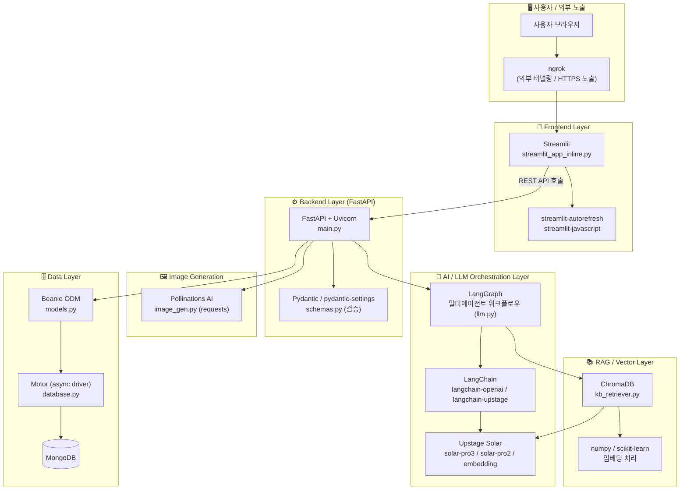
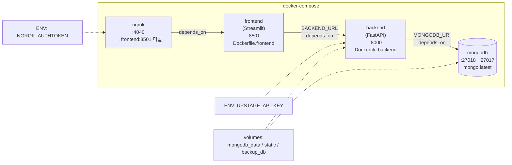
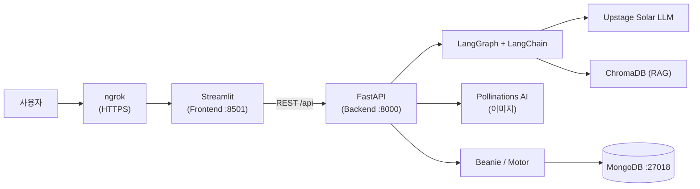

# 기술 스택 플로우 차트

`pyproject.toml` · `docker-compose.yml` 기준으로 정리한 기술 스택 구조입니다.

---

## 1. 계층별 기술 스택 (Layered Architecture)

---

## 2. 카테고리별 기술 스택 요약

| 레이어 | 기술 | 용도 |
| --- | --- | --- |
| **Frontend** | Streamlit, streamlit-autorefresh, streamlit-javascript | 사용자 UI / 동화 뷰어 |
| **Backend** | FastAPI, Uvicorn | REST API 서버 / ASGI 실행 |
| **검증** | Pydantic, pydantic-settings | 요청·응답 스키마 검증 |
| **LLM 오케스트레이션** | LangGraph, LangChain | 멀티에이전트 워크플로우 (retrieve→draft→review→format) |
| **LLM 모델** | Upstage Solar (solar-pro3 / pro2 / embedding), OpenAI SDK, google-genai | 동화 텍스트 생성 / 임베딩 |
| **RAG / VectorDB** | ChromaDB, numpy, scikit-learn | 전문가 지침·모범동화 의미 검색 |
| **이미지 생성** | Pollinations AI (requests) | 페이지별 삽화 생성 |
| **Database** | MongoDB, Beanie(ODM), Motor(async), pymongo | 아동·동화·피드백 저장 |
| **Infra / 배포** | Docker, docker-compose, ngrok | 컨테이너화 / 외부 노출 |
| **Utils** | python-dotenv, json-repair, requests | 환경변수 / JSON 복구 / HTTP |

---

## 3. Docker 컨테이너 구성 (docker-compose.yml)

**포트 매핑**

| 서비스 | 컨테이너 포트 | 호스트 포트 | 이미지 / 빌드 |
| --- | --- | --- | --- |
| `mongodb` | 27017 | **27018** | mongo:latest |
| `backend` | 8000 | 8000 | Dockerfile.backend |
| `frontend` | 8501 | 8501 | Dockerfile.frontend |
| `ngrok` | 4040 | 4040 | ngrok/ngrok:latest |

---

## 4. 요청 흐름으로 본 기술 스택 (End-to-End)

